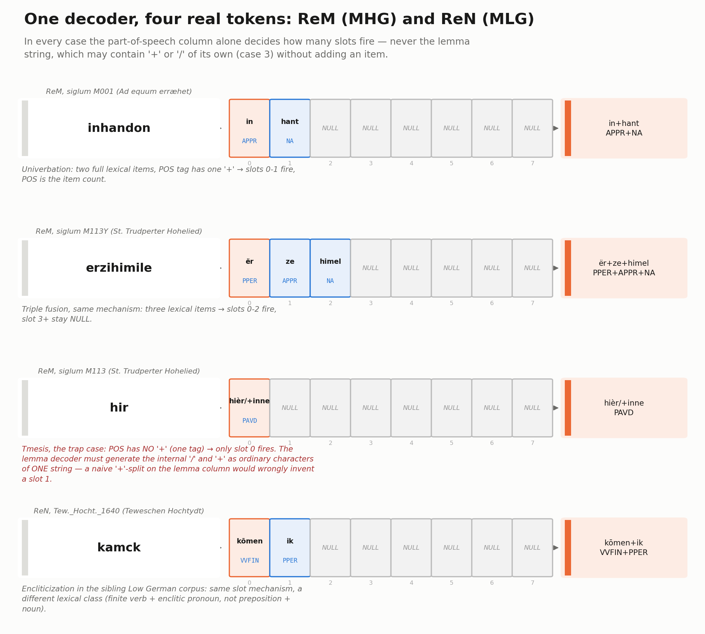
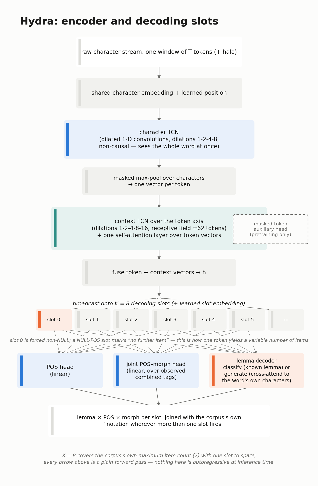
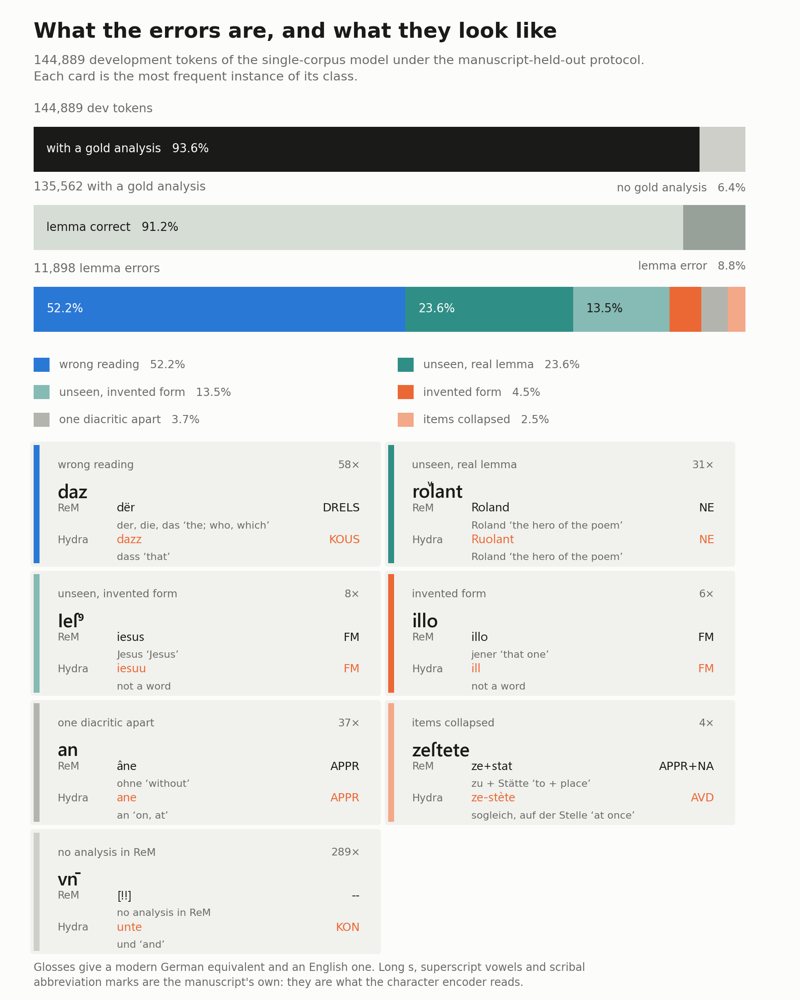

# Hydra

Neural lemmatiser and morphological tagger for pre-modern languages, trained
and evaluated on Middle High German, Early New High German, Middle Low German
and Old German. It reads the manuscript's own spelling. There is no
normalisation step and no tokeniser fitted to a modern corpus.

Complete rewrite of the original mpi4py-based Hydra; the old code is kept
untouched in `legacy/`.

## Two lines

```bash
pip install "hydra-tagger @ git+https://github.com/Lukasz-G/Hydra"
hydra-tag --model de-4corpus --input texts/ --output tagged/
```

The first call downloads the model and caches it; later calls read the cache.
Input is plain text or 4-column TSV, one token per line. Output is the
4-column TSV `surface / lemma / POS / morphology`, with the items of a
multi-item token joined by `+`:

```
gieng   gân      VVFIN   Ind.Past.Sg.3
wege    wëg      NA      Dat.Sg
zoh     zièhen   VVFIN   Ind.Past.Sg.3
ſin     sîn      DPOSA   Neut.Akk.Sg.0
```

That is real output, and it is not perfect output: see [Results](#results) for
what the error rate actually is.

## The problem

A medieval page does not hand a tagger one word per token. Scribes fuse words,
abbreviate them, split one word across a clause, and spell the same word a
dozen ways. Hydra's job is to read what is on the page and return an analysis
for every item in it.

| On the page | Example | ReM's analysis | What a tagger must produce |
|---|---|---|---|
| Two words in one token | *inhandon* | `in+hant` `APPR+NA` | two items from one token |
| A verb with its pronoun attached | *geſtu* | `gân+dû` `VVFIN+PPER` | two items, 'goest thou' |
| Three words in one token | *Deſwar* | `dër+sîn+wâr` `DDS+VAFIN+ADJD` | three items, 'that is true' |
| One word split across the clause | *dar* | `dâr/+zuo` `PAVD` | **one** item, despite the `+` |
| A scribal abbreviation | *vn̄* | `unte` `KON` | expand the nasal bar |
| A spelling never seen in training | 13.2% of held-out tokens | | build the lemma from characters |

The fourth row is the trap. The part-of-speech column counts the items, never
the lemma string: `dâr/+zuo` carries a `+` inside a single lemma, and splitting
on it would invent a second word that is not there.



## How it works

Every token is decoded through **K = 8 parallel slots**. Each slot produces its
own lemma, part of speech and morphology; a NULL tag marks the slots a token
does not use, so the item count falls out of the prediction and does not have
to be decided in advance. The slots run at once, not one after another.

The encoder is character-level throughout. A dilated convolutional network
(TCN) reads the characters of a word, a masked max-pool turns them into one
token vector, and a second TCN carries context across roughly fourteen tokens
either side. Long s (`ſ`), superscript vowels (`uͤ`, `oͮ`), a nasal bar (`vn̄`)
and abbreviation marks (`Ieſꝰ`) reach the model as the characters they are.
Nothing is normalised first, and there is no subword vocabulary fitted to
another corpus's orthography.

The lemma head is open-vocabulary: a closed-set classifier proposes a lemma
and a character generator builds one from the surface, and a confidence
threshold picks between them. A spelling the model has never met still gets a
lemma.



Two further objectives are optional and switch on from the config. A
masked-token auxiliary lets unannotated transcription contribute to training,
and a substitution model learned from ReM's paired diplomatic and normalised
layers perturbs spelling afresh each epoch, so the encoder meets many
realisations of one word. [Architecture](#architecture) gives the full list.

## Models

| Name | Trained on | Parameters | Pass to `--model` |
|---|---|---|---|
| `de-4corpus` | ReM, ReF, ReN and LeA pooled, 6.2M tokens | 46.9M | `--model de-4corpus` |
| `mhg` | ReM alone, manuscript-held-out split | 38M | `--model mhg` |

They are published as assets of the [latest release](https://github.com/Lukasz-G/Hydra/releases/latest)
and cached under `%LOCALAPPDATA%\hydra-tagger` or `~/.cache/hydra-tagger`;
`HYDRA_CACHE` overrides that. `--model` also accepts a path, so
`--model runs/x/best.pt` behaves as before. `hydra-tag --help` lists what is
published.

To cut a release from a run directory of your own:

```bash
python tools/package_model.py runs/stage2 de-4corpus
gh release create v2.0.0 dist/hydra-de-4corpus.tar.gz --generate-notes
```

## Results

Test-set accuracy on the Reference Corpus Middle High German. Pie and
RNNTagger were retrained on Hydra's own split assignments and scored with
Hydra's metric definitions, so the rows are comparable; no published figure
for those systems was reused. Pie reports no joint accuracy.

| System | Protocol | Lemma | POS | Morph | Joint |
|---|---|---|---|---|---|
| Hydra | manuscript-held-out | 88.4 | 90.2 | 84.0 | 75.3 |
| RNNTagger | manuscript-held-out | 88.4 | **91.3** | **85.6** | **77.5** |
| Pie | manuscript-held-out | 82.5 | 87.9 | 81.1 | |
| Hydra | random chunk | **91.8** | **92.2** | **87.3** | **81.0** |
| RNNTagger | random chunk | 88.5 | 90.2 | 86.6 | 79.8 |
| Pie | random chunk | 83.3 | 86.6 | 80.3 | |

Hydra leads on every column under the random-chunk protocol. Under the harder
one the lemma figures are level and RNNTagger is ahead on tag and joint
accuracy, which we report as it stands. The second finding matters more than
the first: the protocol moves the result by over three points of lemma
accuracy with no parameter changed, which is several times any architectural
difference we have measured. A figure quoted without its protocol cannot be
compared with another.

One model over all four corpora, 6,229,750 pooled tokens, manuscript-held-out:

| Corpus | Test tokens | Unseen surfaces | Lemma | POS |
|---|---|---|---|---|
| Early New High German (ReF) | 86,774 | 5.3% | 94.3 | 93.3 |
| Middle Low German (ReN) | 67,584 | 5.8% | 93.7 | 92.5 |
| Middle High German (ReM) | 125,624 | 11.6% | 83.5 | 86.2 |
| Old German (LeA) | 14,147 | 23.1% | 72.3 | 84.1 |

Against a ReM-only model the pooled model neither gains nor loses on Middle
High German beyond the spread across random seeds, and it supplies taggers for
three varieties that had none. Middle High German's figure here is held down
by tokens ReM leaves without an analysis at all; over the tokens that carry
one it is 87.9.

### What the errors are

Most of what Hydra gets wrong is a choice between readings, not a misspelling.
On held-out development data 52% of lemma errors pick a wrong but attested
lemma, and in 35% of all errors the lemma chosen is one the corpus assigns to
that same surface somewhere else.



<!-- Figures and accuracy figures alike are generated by the paper's build,
     which is not part of this repository, from the run logs in runs/:
     batch2_3_results.log (Hydra s_joint, c_joint), batch5_baselines.log
     (Pie, RNNTagger), batch6_results.log (the four-corpus pool).
     Regenerate there before editing anything here by hand. -->

## The corpora

The corpora are not redistributed with this repository, and the tracked
configs point at local paths (`D:/Corpora/...`) that will need changing. Each
is available from its own project:

- **ReM**, Referenzkorpus Mittelhochdeutsch (1050–1350), v2.1:
  <https://www.linguistics.rub.de/rem/>
- **ReF**, Reference Corpus Early New High German (1350–1650), v1.0.2:
  <https://doi.org/10.5281/zenodo.5793616>
- **ReN**, Reference Corpus Middle Low German / Low Rhenish (1200–1650), v1.1:
  <https://doi.org/10.25592/uhhfdm.9195>
- **LeA**, the reading-corpus layer of Referenzkorpus Altdeutsch:
  <http://hdl.handle.net/11022/0000-0007-C9C7-6>

`tools/pool_stage2.py` converts and pools all four into the format below;
`tools/convert_ren.py`, `tools/convert_ref.py` and `tools/map_lea_tags.py`
handle the individual conversions and the tagset mapping.

## The task

Input corpora are 4-column TSV files, one token per line:

```
surface <TAB> lemma <TAB> POS <TAB> morphology
```

Medieval tokens often have **no 1-to-1 mapping** to lemma/tag: one surface
token can realize several items, joined by `+` with aligned counts:

```
inhandon	in+hant	APPR+NA	c.D+Dat.Pl
```

ReM's `/` notation for discontinuous units is understood. In `dâr/+zuo` the
internal `+` belongs to one item's lemma, so the part-of-speech column is
the authoritative item counter; see `hydra.data.split_lemma_items`.

Lines starting with `@` are comments. Each file is one document: context
windows never cross file boundaries.

## Architecture

Character-level, fully convolutional, open lemma vocabulary (~6–12M params):

- shared character embedding → **TCN char encoder** → masked max-pool = token vector
- **TCN context encoder** over the token axis (receptive field ≈ ±14 tokens)
- **K = 8 parallel decoder slots** (non-autoregressive). Each slot classifies
  atomic POS (class 0 = NULL marks an unused slot → variable item count) and
  atomic morph, and generates the lemma as a character grid: transposed-conv
  upsampling + cross-attention to the surface characters + refinement TCN.
  Unseen lemmas are generated character by character.

Training targets: slot k < n gets (lemma chars + EOW, POS, morph); slots
k ≥ n get only a NULL POS target. NULL is down-weighted in the loss
(`loss.null_weight`) and chunks containing multi-item tokens are upsampled
(`data.multi_item_upsample`) to counter the ~95% single-item imbalance.

That is the default model (~6.7M params). Several optional heads and
objectives are off by default and switch on from the config; the configs used
for the paper's runs turn most of them on (~38M params):

- `model.lemma_classifier`: classify-or-generate, a closed-vocabulary lemma
  classifier alongside the character generator. At inference the classifier's
  lemma is taken only above `infer.classifier_min_prob`, else the generator's.
- `model.masked_lm`: a masked-token auxiliary on the context encoder, which
  lets *unannotated* text (`data.extra_train_dir`) contribute to training.
- `model.tag_condition`: a predict-then-condition cascade (POS -> morph ->
  lemma). Gold tags are teacher-forced in training, predicted at inference,
  and gated by `infer.tag_cond_min_prob`. `infer.tag_cond_oracle` feeds gold
  tags as a diagnostic. It separates "does conditioning help" from "does the
  tagger's own error rate eat the gain", and must never be used for reported
  numbers.
- `model.pos_crf`: a linear-chain CRF over the slot-0 POS sequence, decoded
  with Viterbi, modelling the dependency across tokens that the per-token
  heads cannot.
- `data.spelling_noise`: train-time diplomatic-spelling augmentation from a
  learned substitution model (`tools/extract_rem_layers.py`).

`tag_condition` and `pos_crf` add their parameters zero-initialised (the
conditioning projections; the CRF's transition, start and end scores), so
warm-starting from a run that lacks them is a provable no-op at step 0. That
makes the new component the single isolated change against that baseline.
`lemma_classifier` and `masked_lm` add genuinely new heads and carry no such
guarantee.

## Install

```
pip install -e .[dev]        # Python >= 3.10, PyTorch >= 2.1
pytest -q                    # 116 tests, CPU, ~18 s
```

## Train

```
hydra-train --config configs/default.toml
hydra-train --config configs/default.toml --set train.lr=1e-4 --set run.run_dir=runs/x
hydra-train --config configs/default.toml --resume runs/mhd_base/last.pt
```

Everything lands in `run.run_dir`: `config.json`, `split.json`, `vocab.json`,
`metrics.jsonl` (one JSON per event), `best.pt` (best dev lemma+POS joint
accuracy), `last.pt` (resume bit-exactly, RNG state included). Early stopping
via `train.patience`.

Data can be one directory (`data.corpus_dir`, split with
`dev_fraction`/`test_fraction`/`split_seed`) or explicit
`train_dir`/`dev_dir`/`test_dir`.

`data.split_mode` chooses **how** a `corpus_dir` is divided, and it changes
the reported accuracy far more than most modelling choices do:

- `"file"`: random whole manuscripts held out (the default).
- `"stratified"`: whole manuscripts held out, balanced by dialect x period x
  text type and token-weighted. Needs `data.metadata_csv`. This is the hard
  protocol: the test manuscripts are ones no training token came from.
- `"chunk"`: random chunks from within all files, so a test token's own
  manuscript is usually in training. Comparable to what most published
  figures for this task actually measure; the easiest of the three.

The split is written to `run_dir/split.json`, so a reported number can always
be traced back to the exact files behind it. A figure quoted without its
protocol is not comparable to one measured under a different one.

### Multi-GPU / multi-node (torch.distributed DDP)

The same command scales; no code changes:

```
torchrun --nproc_per_node=4 -m hydra.cli train --config configs/default.toml
torchrun --nnodes=2 --nproc_per_node=4 --rdzv_backend=c10d \
         --rdzv_endpoint=host0:29500 -m hydra.cli train --config configs/default.toml
```

Backend is auto-selected (NCCL on Linux+CUDA, gloo otherwise). Without
torchrun it runs as a plain single process on `cuda:0` or CPU, with no setup.
Rank 0 owns vocab building, logging, dev evaluation and checkpoints; data is
sharded per step by `DistributedSampler` over shuffled chunks.

Windows notes (dev box): only gloo works; set `USE_LIBUV=0`; torchrun's
rendezvous can be flaky (Docker Desktop hosts entries), and launching processes
manually with `MASTER_ADDR/MASTER_PORT/RANK/WORLD_SIZE/LOCAL_RANK` env vars
works, and non-main ranks may linger at interpreter exit (kill them; Linux is
the real multi-GPU target).

## Tag

```
hydra-tag --model runs/mhd_base/best.pt --input texts/ --output tagged/
```

`--format txt` (whitespace tokenization), `tsv` (retag column 1), or `auto`.
Output is the 4-column TSV with `+`-joined items; `@` lines pass through.

## Evaluate

```
hydra-eval --model runs/mhd_base/best.pt --split test
hydra-eval --model runs/mhd_base/best.pt --input D:/Corpora/other_gold/
```

Reports accuracy (lemma / POS / morph / joint) overall, on multi-item tokens,
and on tokens unseen in training (OOV), plus mean lemma Levenshtein distance.

## Layout

```
hydra/          the package: config, vocab, data, model, losses, metrics,
                distributed, checkpoint, train, tag, evaluate, snap, noise,
                hub (published-model download), cli
docs/figures/   the figures this README embeds
configs/        default.toml (full corpus), smoke.toml (6 files, 3 epochs),
                and the stratified-protocol run configs, each paired with a
                *_remote.toml variant for a rented GPU
tests/          pytest suite incl. an end-to-end overfit test
tools/          corpus conversion (ReM layers, ReN, PIE, RNNTagger), baseline
                scoring, error analysis, sweeps, remote-GPU setup scripts
meta/           corpus metadata: the ReM manuscript table driving the
                stratified split, extracted spelling layers, norm lookup
legacy/         the pre-2024 mpi4py implementation (reference only)
```

## Licence and citation

Apache-2.0, in `LICENSE`, with `NOTICE` recording the copyright. The licence
covers the code in this repository. It does not cover the annotated corpora,
which are not redistributed here and carry their own terms (see `NOTICE`).

`CITATION.cff` carries the citation metadata, which GitHub's "Cite this
repository" button reads. A paper describing the system and the evaluation
protocols is in preparation; this file will name it when it appears.
